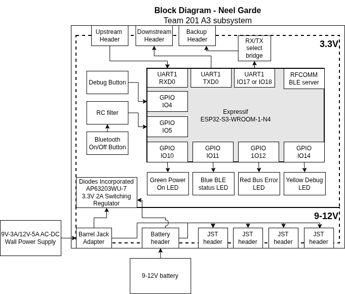
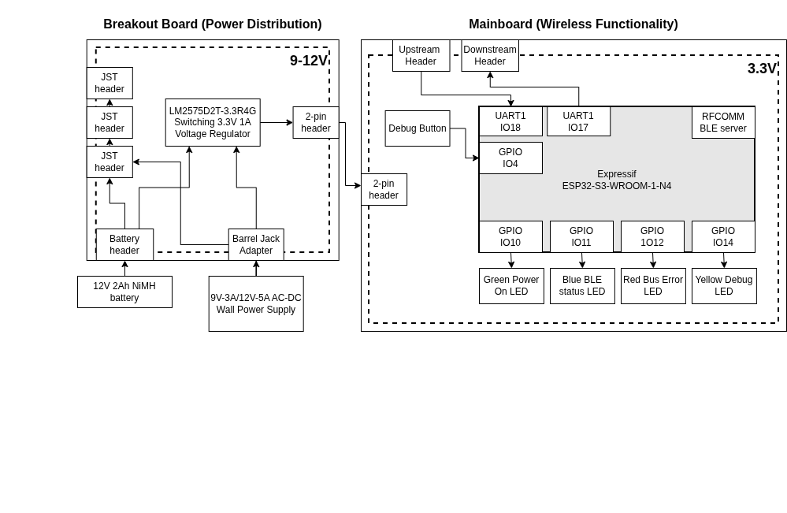

## Overview
Featured on this page is a block diagram for subsystem A2. This subsystem is responsible for being the onboard bluetooth relay, as well as serving as a backup onboard control panel. 
- A 9V (can be raised to 12V or higher if needed) power section handles power sharing across other team boards
    - 9V power is shared through the daisy-chain headers (low current, max 4A total) and through 4 high-current JST headers (10A each, in practice no supply on our system can output this much)
    - A removable battery is connected via a JST header
    - A wall power source (either 9V 2A or 12V 5A) can be connected via a barrel jack.
    - A 3.3V regulator supplies the voltage necessary for the ESP32 to function.
- Data transmission within the robot is handled through 8-pin UART bus connectors.
    - A spare header is provided to connect to either IO18 (RX) or IO17 (TX). These ended up being used to solder wires to the headers, as RXD0 and TXD0 are where the ESP32 can recieve keyboard interrupts and programming instructions.
- Programming is done via a microUSB interface connected to the ESP32 microcontroller.
- In order to facilitate remote control, the ESP32's bluetooth low-energy (BLE) module is used to communicate bidirectionally with subsystem A2 to send sensor data and recieve user input data.

## Block Diagram
The following block diagram represents the intended design: 

[drawio source file](BDV5.drawio)
 
Due to defects in a tape of voltage regulators and some of the PCBs, as well as a design flaw in the UART pins of choice, the following system was prototyped: 

[drawio source file](BDV6.drawio)

## Decision making process
To develop this block diagram for system functionality, the requirements of the system, namely to regulate/distribute power and perform bluetooth functionality were considered. Major points of failure, such as faulty UART headers/pins, extra need for power headers, and debugging buttons were considered. With all of these required components, the simplest connection layouts were chosen.