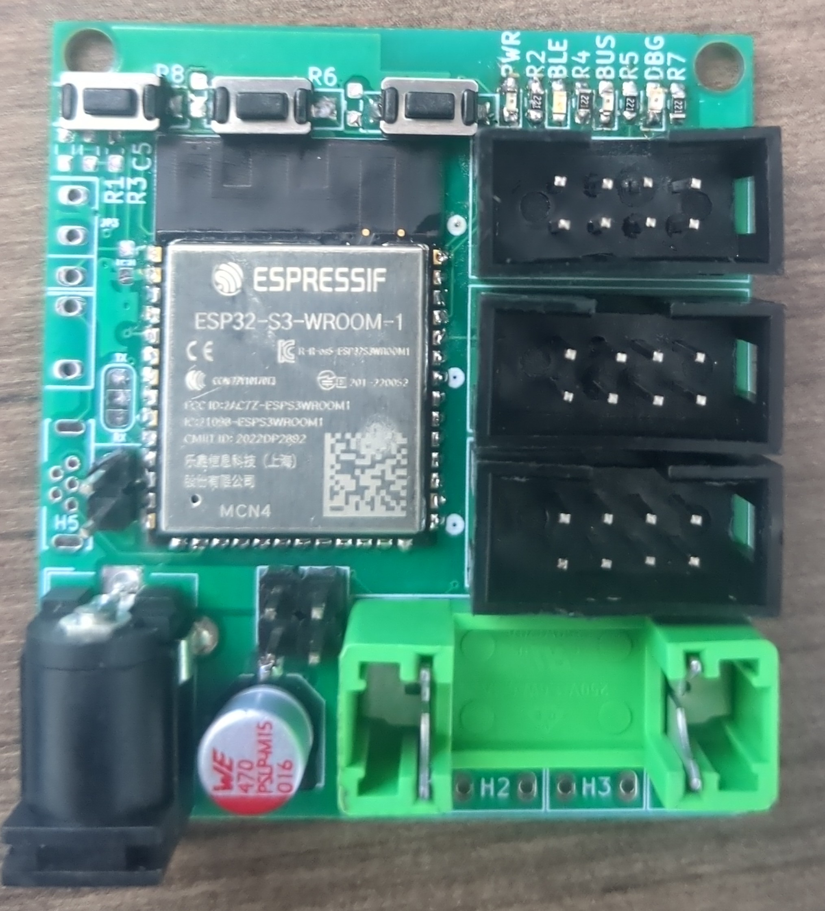
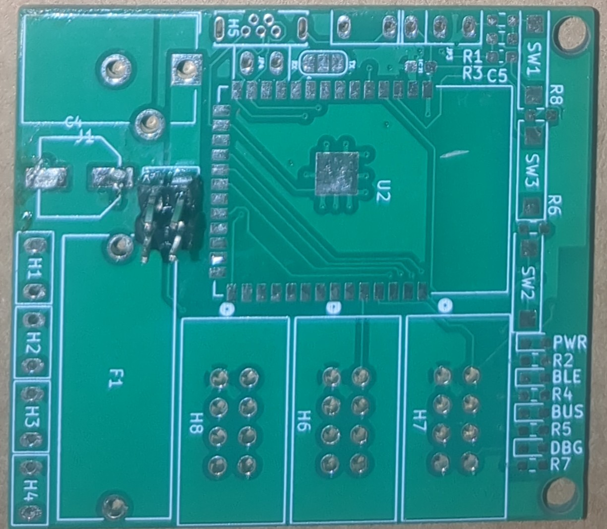
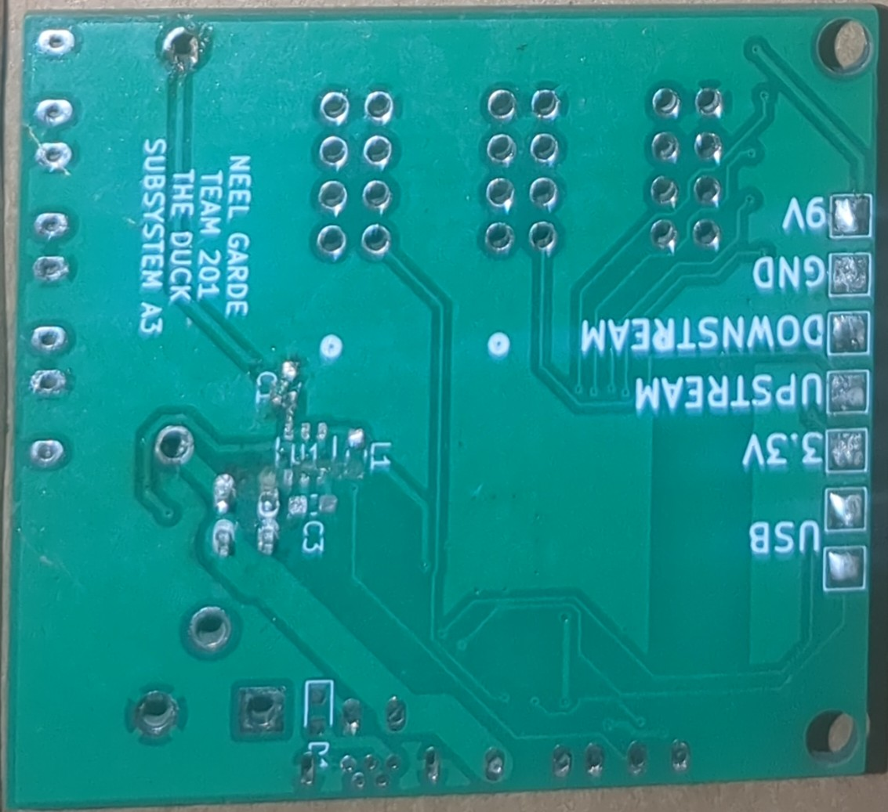

## PCB

The PCB for subsystem A3 contains all components except for the battery, which is external and attached via a header. The PCB was made in KiCAD and will be manufactured by JLCPB. The PCB can be downloaded as [gerber files](NeelGarde201.zip) or a [KiCAD project archive](A3V4.zip).  
Front: 

 
Back: 

 
Populated PCB: 

Blank PCB front: 

 
Blank PCB back:  

 
