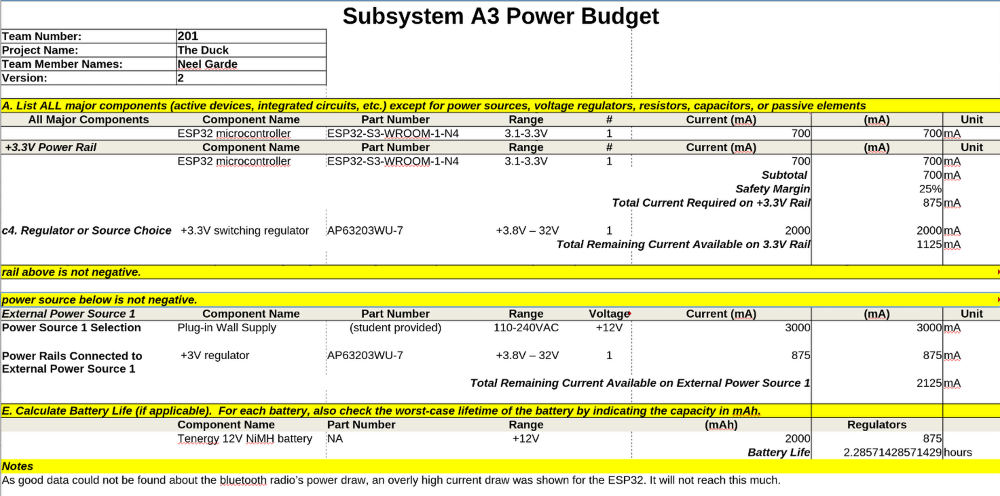

### Power Budget
The power budget for subsystem A3 is calculated in the following chart:

The spreadsheet used to calculate this is available as a [*Microsoft Excel*](PBV2.xlsx) or [*Open Document Format*](PBV2.ods) sheet. 
During the Innovation Showcase event, the ROV's motors were disabled, as the arm/camera subsystem and rudder motors were nonfunctional, and the propulsion motors were left at idle due to an error with the daisy-chain network preventing them from recieving throttle commands. In this state, with the battery powering all systems at idle, actively broadcasting bluetooth, and with all sensors active, the ROV operated for a continuous 7 hours.
These findings are expected, as the concrete numbers used from datasheets were maximums, since "standard operating" power draw data was largely unavailable. 
